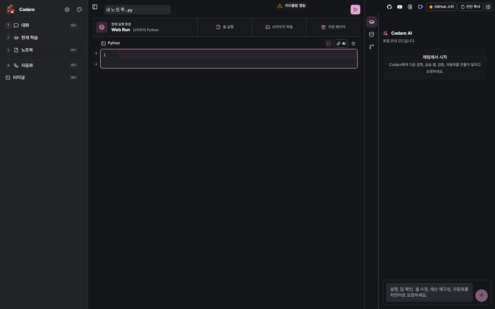
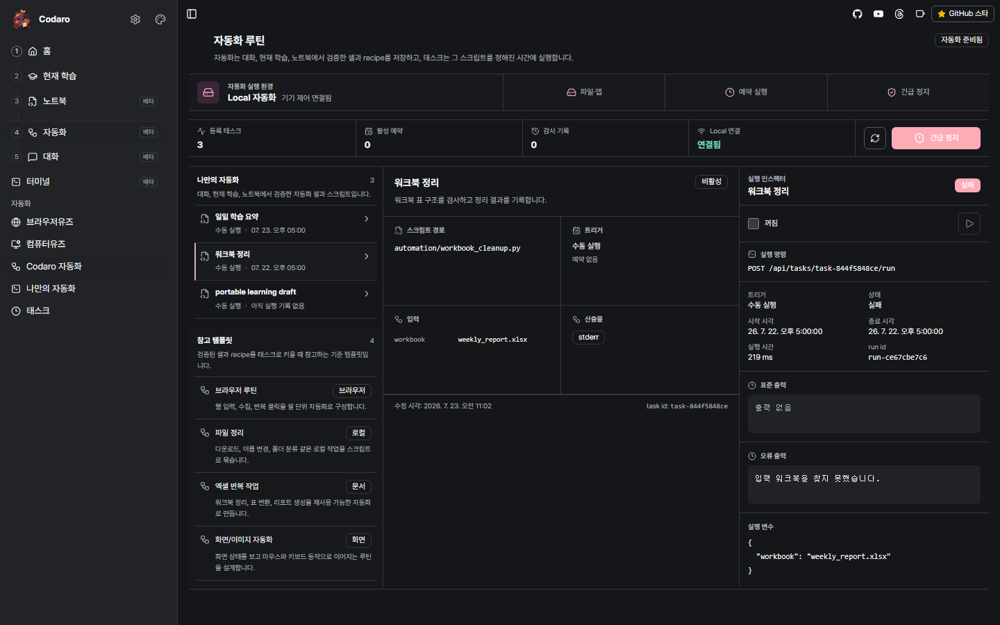

<div align="center">

<h3 align="center">
  <br/>
  Codaro
</h3>

**다운로드 없이 시작하는 Python 학습, 내 파일과 패키지까지 이어지는 Local 자동화 스튜디오.**

웹에서 배우고 직접 코드를 고친 뒤 실행합니다. 실제 파일, 자유로운 패키지, 예약 자동화가 필요해질 때 같은 학습 상태를 Local로 이어갑니다.

<sub><em>코다로(Codaro) - "코드 아로?" "코드 아로~" 코드와 친해지자는 말장난에서 시작한 이름입니다.</em></sub>

<p>
  <a href="https://github.com/eddmpython/codaro/releases/latest"></a>
  <a href="https://github.com/eddmpython/codaro/actions/workflows/product-release.yml"></a>
  <a href="https://pypi.org/project/codaro/"></a>
  <a href="https://github.com/sponsors/eddmpython"></a>
  <a href="LICENSE"></a>
</p>

<p>
  
  
  
  
</p>

<p>
  <a href="https://eddmpython.github.io/codaro/learn/"></a>
  &nbsp;&nbsp;
  <a href="https://github.com/eddmpython/codaro/releases/latest/download/Codaro.exe"></a>
</p>

<p>
  <a href="https://eddmpython.github.io/codaro/learn/"><strong>Learn</strong></a> ·
  <a href="https://github.com/eddmpython/codaro/releases/latest"><strong>Local 릴리즈</strong></a> ·
  <a href="https://github.com/eddmpython/codaro/issues">이슈</a>
</p>

</div>

---

**Codaro**는 **웹 학습, reactive 코드 실행, Local 자동화**를 하나의 문서와 학습 기록으로 잇는 programmable studio입니다. 학습 진입은 Web-first입니다. Local-first는 설치를 강요한다는 뜻이 아니라 실제 파일, 패키지, 프로세스와 자동화 결과를 사용자가 소유한다는 실행 경계입니다.

> **한 줄로** - 웹에서는 바로 배우고, Local에서는 같은 코드를 내 환경의 반복 업무로 확장합니다.

<table>
  <tr>
    <td width="50%" align="center">
      <br/>
      <sub><strong>Web</strong> - 설치 없이 레슨을 읽고 코드를 수정하며 학습</sub>
    </td>
    <td width="50%" align="center">
      <br/>
      <sub><strong>Local</strong> - 파일·패키지·스케줄을 연결해 자동화 운영</sub>
    </td>
  </tr>
</table>

## Web에서 바로 시작

**[Codaro Learn](https://eddmpython.github.io/codaro/learn/)** 에서 목표와 학습 경로를 탐색할 수 있습니다. 설치나 계정 없는 개별 레슨과 Web 실행 workspace는 소스에 구현됐고, 현재 Pages 반영을 진행하고 있습니다.

총 **472개 레슨**은 같은 커리큘럼을 사용합니다. 이 가운데 **310개는 Web 지원**, **162개는 Local 완료가 필요한 레슨**입니다. Web 지원의 기준은 브라우저에서 직접 수정·실행·자동 강검증·진도 저장까지 끝내는 것이며, Local 전용 범위를 약한 검증으로 바꾸지 않습니다.

학습은 다음 내용을 보기 위해 버튼을 순서대로 누르는 과정이 아닙니다. 한 레슨 안에서 다음 흐름이 끊기지 않고 이어집니다.

1. 핵심 설명과 바로 쓸 맥락을 읽습니다.
2. 준비된 코드를 학습자가 직접 수정합니다.
3. 수정한 코드를 실행합니다.
4. 실행과 함께 의미를 검사하는 강한 검증이 자동으로 동작합니다.
5. 실패 지점, 원인, 필요한 힌트와 다음 구간이 즉시 이어집니다.
6. 다른 조건의 전이 과제와 나중의 회상 과제로 독립 수행을 증명합니다.

> 현재 공개 웹 진입점은 Learn입니다. Web 실행 workspace의 Pages 반영은 진행 중이므로 준비되지 않은 `/run/` 주소를 README에서 직접 링크하지 않습니다.

## Local로 확장

Local은 웹 학습의 입장권이 아닙니다. 실제 파일·폴더, 임의 Python 패키지, 터미널과 외부 프로세스, 상주 스케줄, Webhook, GUI 자동화가 필요한 작업을 맡습니다. Web에서 쌓은 학습 기록과 작업물을 내보내 같은 학습 맥락으로 이어갈 수 있습니다.

**비개발자도 런처를 더블클릭하면 시작할 수 있습니다.** 시스템 Python과 `uv`는 런처가 관리형 환경에 구성합니다.

<p align="center">
  <a href="https://github.com/eddmpython/codaro/releases/latest/download/Codaro.exe"></a>
</p>

> ⚠️ **런처는 아직 안정화 작업 중입니다 (초기 베타).** 일부 환경에서 설치·실행 중 오류가 날 수 있습니다. 문제가 생기면 [이슈로 알려주세요](https://github.com/eddmpython/codaro/issues) - 화면에 뜬 메시지나 로그를 함께 남겨주시면 빠르게 고치겠습니다.

> 🛡️ **"Windows의 PC 보호" 경고가 떠도 정상입니다.** Codaro.exe는 아직 코드 서명 인증서가 없어 Windows SmartScreen이 *알 수 없는 게시자*로 표시할 수 있습니다 - 악성코드라서가 아니라 다운로드 평판이 아직 쌓이지 않아서입니다. 파란 경고 화면에서 **추가 정보 → 실행**을 누르면 시작됩니다. 받은 파일이 변조되지 않았는지는 아래 체크섬으로 직접 검증할 수 있습니다.
>
> ```powershell
> # 다운로드한 Codaro.exe의 해시를 릴리즈의 Codaro.exe.sha256 값과 비교
> (Get-FileHash .\Codaro.exe -Algorithm SHA256).Hash.ToLower()
> ```

1. **[Codaro 런처 다운로드](https://github.com/eddmpython/codaro/releases/latest/download/Codaro.exe)** _(Windows 10/11)_
2. 받은 파일을 **더블클릭**합니다. *"Windows의 PC 보호" 경고가 뜨면 **추가 정보 → 실행**.*
3. 첫 실행에서 런처가 자동으로 - 관리형 Python runtime + `codaro` 본체 + **기본 커리큘럼(472 레슨)** 을 내려받아 설치합니다. (네트워크/디스크에 따라 몇 분)
4. 준비가 끝나면 로컬 에디터(`http://127.0.0.1:8765`)로 자동 전환 - **학습 경로에서 레슨을 열어 바로 시작**합니다.

> 시스템에 Python이 없어도 됩니다. 런처가 격리된 관리형 런타임을 따로 설치하므로 기존 환경을 건드리지 않습니다.

**AI provider는 필수가 아닙니다.** 472개 커리큘럼과 강한 검증은 정해진 학습 계약으로 동작하고, provider를 연결하면 다음 학습 추천과 셀 단위 확장을 추가할 수 있습니다.

### 첫 실행에서 자동 구성되는 것

| 구성 요소 | 역할 |
|---|---|
| 관리형 Python 3.12 runtime | 시스템 Python과 분리된 격리 실행 환경 |
| `codaro` wheel | 에디터(React) · 실행 엔진 · **기본 커리큘럼(472 레슨)** 포함 |
| `release-manifest.json` | 정확한 wheel·runtime 버전을 핀. 런처가 같은 경로로 업데이트를 확인 |

- **모두 자동, 자체 업데이트** - 런처는 실행할 때마다 본체 릴리스와 *런처 자신의 새 버전*을 확인해 갱신합니다.
- **PyPI는 개발자 설치 채널** - 런처는 여전히 GitHub Releases manifest가 핀한 wheel만 설치하고, PyPI는 Python 생태계 검색과 개발자 설치용 보조 배포 채널로 둡니다.
- **macOS / Linux** - 데스크톱 런처는 Windows 우선입니다. 다른 OS는 아래 [개발자 - 저장소에서 바로](#개발자--저장소에서-바로)로 동일 기능을 사용하세요.

## 목차

- [Web에서 바로 시작](#web에서-바로-시작)
- [Local로 확장](#local로-확장)
- [Codaro는 무엇이 다른가](#codaro는-무엇이-다른가)
- [Codaro vs Jupyter · marimo · Streamlit · ipynb](#codaro-vs-jupyter--marimo--streamlit--ipynb)
- [어떤 사람에게 맞는가 - Use cases](#어떤-사람에게-맞는가--use-cases)
- [제품 표면 네 가지](#제품-표면-네-가지)
- [실행 메커니즘](#실행-메커니즘)
- [11 사상](#11-사상-요약)
- [학습 시스템 - 3기둥](#학습-시스템--3기둥)
- [AI 통합 - tool_use 기반](#ai-통합--tool_use-기반)
- [AI 감각계 - 눈·귀·손](#ai-감각계--눈--귀--손)
- [자동화 + 태스크](#자동화--태스크)
- [마운팅과 통합](#마운팅과-통합)
- [설치 & 시작](#설치--시작)
- [기술 스택](#기술-스택)
- [저장소 구조](#저장소-구조)
- [FAQ](#faq)
- [문서 · 라이선스 · 신뢰 문서](#문서)

## Codaro는 무엇이 다른가

- **Web-first 학습** - 공개 Learn에서 목표와 경로를 고르고, Web 지원 레슨은 다운로드 없이 수정·실행·강한 검증·진도 저장까지 이어집니다.
- **Local-first 소유와 자동화** - 실제 파일·패키지·프로세스·credential·자동화 결과는 사용자 환경에 남습니다. Local은 Web의 유료 해제나 필수 선행 단계가 아니라 더 강한 실행 tier입니다.
- **투명 스코프 격리** - 사용자는 평범한 Python을 씁니다. 함수 래핑·return·boilerplate 없음. 엔진이 AST로 `defines`/`uses`를 추론해 셀별 네임스페이스를 격리합니다.
- **리액티브 실행** - 한 셀 변수에 의존하는 하위 셀이 자동 재실행됩니다. 의존 선언 불필요, 에러 발생 시 전파 중단.
- **Percent Format이 SSOT** - `# %% [code]` / `# %% [markdown]` 경계의 `.py`가 기본 저장 포맷. `python file.py`로 그대로 실행되고, VS Code / Spyder / Jupytext가 같은 포맷을 인식합니다. `.ipynb` 변환은 양방향.
- **같은 셀, 네 표면** - 채팅의 응답, 에디터의 노트북, 커리큘럼의 레슨과 학습 셀, 자동화의 태스크가 모두 같은 문서 모델 위에서 움직입니다.
- **AI는 선택적, 그러나 1급** - AI 없이도 학습·실행·자동화가 완전 동작합니다. AI가 붙으면 제품 API를 `tool_use`로 호출해 셀을 만들고 실행/검증합니다. Provider 교체 가능: **GPT · Claude · Ollama · 없음**.
- **AI 감각계** - Vision(화면 캡처·OCR), Voice(Whisper), Input(PyAutoGUI + InputGuard)을 tool로 노출해 "보고-판단-행동하는" 데스크톱 에이전트로 동작. 녹화 → Python 코드 변환 포함.
- **자동화 승격 경로** - 검증된 셀 조합이 태스크가 됩니다. 스케줄(`@every_5m`, `@daily`) · Webhook · 수동 트리거 + 워크플로우 DAG + 감사 로그(JSONL) + **E-Stop**.
- **외부 채널** - Slack / Discord / Webhook MessageBridge로 데스크톱 앞에 없을 때도 트리거·결과 수신.
- **마운팅 가능** - `createServerApp()`을 FastAPI / Django / Flask 어디든 마운트. **GUI에서 되는 것은 모두 API로 됩니다.**

## Codaro vs Jupyter · marimo · Streamlit · ipynb

| 기준 | Codaro | Jupyter | marimo | Streamlit |
|---|---|---|---|---|
| **저장 포맷** | `.py` (percent format) | `.ipynb` (JSON) | `.py` | `.py` |
| **외부 IDE 호환** | ✅ VS Code / Spyder / Jupytext 모두 | ⚠ `.ipynb` 차이로 diff 노이즈 | ✅ | ✅ |
| **셀 격리 모델** | 투명 격리 (AST 자동) | 글로벌 네임스페이스 | reactive cell graph | 스크립트 재실행 |
| **리액티브 재실행** | ✅ AST 기반 | ❌ 수동 실행 순서 | ✅ | ✅ (전체 재실행) |
| **사용자가 쓰는 코드** | 평범한 Python (no return) | 평범한 Python | 함수 래핑 + `return` | UI 함수 호출 |
| **설치 없는 학습 진입** | ✅ Web 지원 레슨 | ⚠ 별도 배포 필요 | ✅ | ✅ 공개 앱일 때 |
| **로컬 실행 소유권** | ✅ 파일·패키지·프로세스·결과 | ✅ | ✅ | ✅ |
| **AI 셀 단위 tool_use** | ✅ 기본 | ⚠ 확장 | ❌ | ❌ |
| **자동화 태스크 승격** | ✅ 스케줄·Webhook·DAG·E-Stop | ❌ | ❌ | ❌ |
| **데스크톱 자동화** | ✅ Vision/Voice/Input | ❌ | ❌ | ❌ |
| **학습 커리큘럼 1급** | ✅ 472 YAML 레슨 | ❌ | ❌ | ❌ |
| **외부 서버 마운트** | ✅ FastAPI/Django/Flask | ⚠ | ⚠ | ⚠ |
| **라이선스** | Non-Commercial Source 1.0 | BSD | Apache 2.0 | Apache 2.0 |

요약하면 - **Jupyter의 편리함 + marimo의 reactive 안전성 + IDE percent format 호환 + 자동화/감각계까지 한 제품으로**.

## 어떤 사람에게 맞는가 - Use cases

| 사용자 | 무엇을 얻나 |
|---|---|
| **Python 학습자** | 472개 레슨을 카테고리 트리로 탐색. 설명 → 직접 수정 → 실행 → 자동 강검증 → 피드백 → 전이·회상 흐름이 한 화면에서 이어짐. |
| **데이터 분석가** | pandas/polars/duckdb 셀이 reactive로 묶여 입력 바꾸면 하위 계산이 자동 재실행. 검증된 분석은 매일 돌아가는 태스크로 승격. |
| **반복 업무가 많은 직장인** | "매주 CSV 정리 → 리포트 → Slack 알림"을 셀 조합으로 만들고 `@every_5m` 스케줄로 등록. E-Stop으로 즉시 중단. |
| **데스크톱 자동화 개발자** | Vision(OCR/템플릿 매칭) + Input(PyAutoGUI + InputGuard)으로 GUI 자동화 스크립트를 녹화 → Python으로 변환. |
| **AI 코드 교사 제작자** | GPT/Claude/Ollama provider를 꽂아 `read-cells`, `write-cell`, `cell-call`, `check-exercise` tool로 셀 단위 교육 루프 구성. |
| **사내 도구 빌더** | `createServerApp()`을 FastAPI/Django 앱에 마운트해 노트북 UI를 내부 도구로 임베드. |
| **교육자 / 강사** | 커리큘럼 YAML로 강의 자산을 작성하고 share pack으로 배포. 학습자는 manifest URL 한 줄로 설치. |
| **개인 자동화 매니아** | Slack/Discord 한 마디로 로컬 태스크를 트리거하고, 폰에서 결과를 받는 개인 자동화 허브로 운영. |

## 제품 표면 네 가지

Codaro의 제품 폴더는 [`editor/`](editor/)이고, 사용자에게 보이는 1급 표면은 네 개입니다. Web과 Local은 별도 제품이 아니라 같은 정보 구조와 Astryx 디자인 시스템을 쓰며, 실행 capability만 다릅니다.

| 표면 | 진입 의도 | 핵심 동작 |
|---|---|---|
| **채팅** | "이걸 배우고 싶어 / 만들어줘"를 자연어로 시작 | AI가 curriculum YAML 작성 → `write-curriculum-yaml` → 학습 셀 전개 |
| **에디터** | 빈 노트북에서 직접 Python·Markdown 셀 작성 | percent format 저장, reactive 재실행, 변수 인스펙터 |
| **커리큘럼** | 카테고리 트리에서 학습 경로와 레슨으로 진입 | `curricula/` YAML을 같은 `yamlToDocument`로 학습 셀화 |
| **자동화** | Local에서 셀 조합·스크립트를 태스크로 등록 | 스케줄/Webhook/수동 트리거, DAG 워크플로우, 감사 로그, E-Stop |

> **리포트는 1급 표면이 아닙니다.** 자동화/태스크 실행 결과(stdout, 변수 스냅샷, 에러)를 읽기 좋게 보여주는 산출물로만 다룹니다.

## 실행 메커니즘

```text
사용자가 작성한 .py (Percent Format)
        │
        ▼
┌──────────────────────────────────────────────┐
│  Document Model - 셀 경계 + 메타데이터        │
│  (role, displayKind, executionKind, payload) │
└──────────────────────────────────────────────┘
        │
        ▼
┌──────────────────────────────────────────────┐
│  Execution Engine - AST 분석으로              │
│  defines/uses 추론 → 셀별 네임스페이스 격리    │
│  → 의존 그래프 → 리액티브 재실행 → 출력 캡처   │
└──────────────────────────────────────────────┘
        │
        ▼
┌──────────────────────────────────────────────┐
│  Web과 Local의 네 표면이 같은 셀을 표현         │
│  채팅 · 에디터 · 커리큘럼 · 자동화             │
└──────────────────────────────────────────────┘
```

5층 경계(`core` → `engine` → `domain` → `transport` → entry)는 [아키텍처 개요](docs/skills/architecture/overview.md)와 [SSOT 맵](docs/skills/architecture/ssot-map.md).

## 11 사상 (요약)

핵심 식별성은 [docs/skills/identity/](docs/skills/identity/) 11개 문서에 있습니다.

1. [투명 스코프 격리](docs/skills/identity/transparent-scope-isolation.md) - 사용자는 그냥 Python을 쓰고, 엔진이 셀 격리한다.
2. [리액티브 실행](docs/skills/identity/reactive-execution.md) - AST 의존 분석으로 하위 셀 자동 재실행.
3. [Percent Format](docs/skills/identity/percent-format.md) - `# %%` 경계, `python file.py` 실행, ipynb 양방향.
4. [로컬 우선 런타임](docs/skills/identity/local-first-runtime.md) - 파일·패키지·프로세스와 자동화 결과를 사용자 환경이 소유한다.
5. [학습 3기둥](docs/skills/identity/learning-three-pillars.md) - 노트북 + 뼈대 커리큘럼 + 학습 사상.
6. [AI 통합](docs/skills/identity/ai-integration.md) - AI는 선택적 확장, 제품 API를 tool_use로 사용.
7. [마운팅과 통합](docs/skills/identity/mounting-and-integration.md) - `createServerApp()` + "GUI=API".
8. [자동화 + 태스크](docs/skills/identity/automation-tasks-reports.md) - .py가 곧 태스크, DAG, 감사 로그, E-Stop.
9. [제품 표면 모드](docs/skills/identity/multi-editor-modes.md) - 채팅·에디터·커리큘럼·자동화.
10. [AI 감각계](docs/skills/identity/ai-sensory-system.md) - 눈(Vision) · 귀(Voice) · 손(Input).
11. [외부 채널 + 모바일](docs/skills/identity/external-channels-mobile.md) - Slack/Discord/Webhook + 향후 PWA.

## 학습 시스템 - 3기둥

- **기둥 1 - 노트북 기능**: 셀 편집/실행/리액티브 그대로가 학습 환경.
- **기둥 2 - 뼈대 커리큘럼**: `curricula/` YAML 472개 레슨, 카테고리 트리로 진입.
- **기둥 3 - 학습 사상**: 코드로 정의된 교육 철학. AI도 사람도 따른다.
  - 맥락 있는 설명 · 직접 수정 · 즉시 실행 · 자동 강검증 · 오류에서 이어지는 피드백
  - 점진적 빌드 · 필요한 만큼의 힌트 · 반복 변주 · 전이 과제 · 지연 회상

### 커리큘럼 트리 (현재 트랙)

```text
curricula/python/
├── basics/           # 30days · builtins · advancedPython
├── dataAnalysis/     # numpy · pandas · polars · duckdb · pydantic
├── visualization/    # matplotlib · seaborn · plotly · altair · folium
├── imageVision/      # pillow · opencv · visionBasics · visionFeatures · deepVision · visionApps
├── mathStatsMl/      # scipy · statsmodels · sklearn · sympy · networkx
└── automation/       # os · text · office · browser · test
```

레슨 YAML은 `meta.id` / `meta.category` / `meta.packages` / `tags`를 가진 학습 자산이며, 패키지는 레슨을 열 때 `packages-check → packages-install(누락 시) → cell-call` 순서로 lazy preflight됩니다.

## AI 통합 - `tool_use` 기반

AI는 응답 텍스트가 아니라 **셀 조작 로그**로 가르칩니다.

| 그룹 | 도구 | 의미 |
|---|---|---|
| curriculum | `write-curriculum-yaml` | YAML 학습 명세 → 학습 셀 materialize |
| read | `read-cells`, `get-blocks`, `get-variables` | 셀/런타임/화면 상태 읽기 |
| write | `write-cell` | 단일 셀 삽입/수정/삭제 |
| dependency | `packages-check`, `packages-install` | uv 기반 lazy 의존성 |
| execute | `cell-call`, `execute-reactive`, `check-exercise` | 셀 단위 실행/검증 |
| progress | `track-achievement` | 학습 완료/숙련도 |

AI는 `GET /api/curriculum/learning-spec`에서 학습 사상을 읽고 동일 철학으로 셀을 만듭니다. Provider는 교체 가능 - **GPT(OAuth) · Claude · Ollama(로컬) · 없음**.

## AI 감각계 - 눈 · 귀 · 손

데스크톱 자동화를 위한 별도 축. 모든 감각이 `tool_use`로 노출됩니다.

- **눈** - OpenCV + dxcam/mss 캡처, PaddleOCR/EasyOCR, 템플릿 매칭/윤곽선 분석
- **귀** - Whisper 음성 인식 → CommandParser 구조화 명령
- **손** - PyAutoGUI/DirectInput/Accessibility API, **InputGuard**가 속도·영역 제한
- **녹화 → 코드** - 사용자 동작을 percent format `.py`로 자동 생성
- **자동화 루프** - 다단계 액션 + 화면 검증 + 재시도 + 상태 머신

xlwings 같은 도메인 라이브러리도 같은 구조에 탑재 가능합니다.

## 자동화 + 태스크

검증된 셀이 곧 실행 가능한 태스크입니다.

- **트리거** - 스케줄(`@every_5m`, `@daily`) · Webhook · 수동
- **워크플로우 DAG** - 태스크 의존성으로 묶음
- **감사 로그** - 모든 액션을 JSONL에 기록
- **E-Stop** - 비상 정지로 즉시 전체 중단
- **결과 산출물** - 변수 스냅샷·stdout·에러를 리포트로 조회

`Codaro 자동화`(기본 제공 템플릿)와 `나만의 자동화`(사용자 작성) 두 영역으로 표면이 정리됩니다.

## 마운팅과 통합

```python
from fastapi import FastAPI
from codaro import createServerApp

app = FastAPI()
app.mount("/codaro", createServerApp())
```

- **FastAPI**: `app.mount("/codaro", createServerApp())`
- **Django**: ASGI 라우팅 분기
- **Flask**: WSGIMiddleware 래핑
- 프론트엔드는 `<meta name="codaro-base">`로 root_path 자동 감지

## 설치 & 시작

### Windows 런처 (권장)

릴리즈 manifest가 지정한 Python runtime + 정확한 `codaro` wheel 조합만 설치하고, 같은 manifest 경로로 업데이트를 확인합니다.

| 항목 | 링크 |
|---|---|
| Codaro Launcher | [Codaro.exe](https://github.com/eddmpython/codaro/releases/latest/download/Codaro.exe) |
| 체크섬 | [Codaro.exe.sha256](https://github.com/eddmpython/codaro/releases/latest/download/Codaro.exe.sha256) |
| 릴리즈 manifest | [release-manifest.json](https://github.com/eddmpython/codaro/releases/latest/download/release-manifest.json) |
| 관리형 Python runtime | [python-runtime-win-x64.zip](https://github.com/eddmpython/codaro/releases/latest/download/python-runtime-win-x64.zip) |
| SBOM | [codaro.spdx.json](https://github.com/eddmpython/codaro/releases/latest/download/codaro.spdx.json) |
| 전체 릴리즈 | [GitHub Releases](https://github.com/eddmpython/codaro/releases/latest) |

### 개발자 - 저장소에서 바로

```powershell
# 개발·테스트·시각 자산 검증 의존성 설치
uv sync --extra dev

# 에디터 열기 (기본 채팅 표면)
uv run codaro

# 노트북 열기
uv run codaro notebook.py

# 앱 모드
uv run codaro app notebook.py

# .py ↔ ipynb 변환
uv run codaro export notebook.py --format ipynb

# 자동화 태스크 실행
uv run codaro task run notebook.py
uv run codaro task list

# 학습/배포용 share pack
uv run codaro pack inspect ./my-pack
uv run codaro pack install ./my-pack
```

### 개발자 - PyPI 패키지

PyPI 게시본은 long-lived token 없이 GitHub Actions Trusted Publisher로 발행됩니다. 저장소 릴리즈가 published 된 뒤 `.github/workflows/publish.yaml`이 `pypi` 환경에서 `codaro` wheel과 sdist를 업로드합니다.

```powershell
uvx codaro
```

### 5분 체험 - 설치 전에도 가능

```powershell
uv run python -X utf8 demos/publicLaunch/expenseSummaryDemo.py
uv run python -X utf8 demos/publicLaunch/fileOrganizerDemo.py
```

전체 흐름: [Five Minute Quickstart](demos/publicLaunch/fiveMinuteQuickstart.md) · [Video Storyboard](demos/publicLaunch/videoStoryboard.md)

## 기술 스택

| 영역 | 도구 |
|---|---|
| **Backend** | Python 3.12+, FastAPI, uvicorn, Pydantic 2, PyYAML |
| **Runtime** | `uv` (실행/설치/락 관리), AST 기반 reactive engine, percent format parser |
| **Frontend** | React 19, Vite 7, TypeScript 5, CodeMirror 6, Tailwind 4, Radix UI |
| **Vision / Voice / Input** | OpenCV, dxcam/mss, PaddleOCR/EasyOCR, Whisper, PyAutoGUI |
| **Browser automation** | Playwright |
| **Packaging / Distribution** | uv_build, GitHub Release manifest + SBOM, Windows 런처 |

## 저장소 구조

```text
codaro/
├── src/codaro/        # Python 패키지 (engine / kernel / runtime / curriculum / ai / automation / api ...)
├── editor/            # 제품 UI (React 19 + Vite + CodeMirror + Tailwind)
├── curricula/         # 기본 학습 자산 YAML (472 레슨)
├── notebooks/         # curricula에서 파생된 배포용 노트북
├── demos/             # 공개 데모 + 5분 quickstart
├── launcher/          # 데스크톱 런처 + 업데이터
├── landing/           # GitHub Pages + 문서/블로그 표면
├── docs/skills/       # 제품 사상 / 아키텍처 / 운영 SSOT (사람과 AI가 같이 읽는다)
├── assets/            # 브랜드 자산
└── tests/             # pytest + gate runner + verifier
```

상세 배치 규칙: [Repository Structure](docs/skills/architecture/repository-structure.md)

## FAQ

<details>
<summary><strong>Codaro는 Jupyter 대안인가요?</strong></summary>

부분적으로 그렇습니다. Codaro는 Jupyter의 셀 단위 실행 편의성을 유지하면서 다음을 더합니다 - (1) `.ipynb` JSON 대신 percent format `.py`로 저장해 IDE diff와 git history가 깨끗하고, (2) AST 기반 reactive 재실행으로 셀 실행 순서 문제를 없애며, (3) 학습 커리큘럼·데스크톱 자동화·태스크 스케줄링이 같은 문서 모델 위에 1급으로 존재합니다. ipynb 양방향 변환은 그대로 지원합니다.
</details>

<details>
<summary><strong>marimo와는 어떻게 다른가요?</strong></summary>

marimo는 reactive 모델을 사용하지만 셀 함수 래핑과 명시적 `return`을 요구합니다. Codaro는 사용자가 평범한 모듈 레벨 Python을 쓰고 엔진이 AST로 격리/의존성을 *투명하게* 처리합니다. 또한 marimo는 분석/대시보드에 가깝지만, Codaro는 학습 커리큘럼·AI tool_use·데스크톱 자동화(Vision/Voice/Input)·태스크 스케줄링까지 같은 표면에 포함합니다.
</details>

<details>
<summary><strong>AI 없이도 쓸 수 있나요?</strong></summary>

네. 기본 커리큘럼, 코드 실행과 결정적 검증은 provider에 의존하지 않습니다. GPT / Claude / Ollama(로컬)는 선택적 확장이며, 연결하면 제품 API를 `tool_use`로 호출해 셀 단위 추천과 편집을 돕습니다. 학습 상태는 대화 문구가 아니라 실제 실행과 검증 증거에서 파생됩니다.
</details>

<details>
<summary><strong>로컬에서만 동작하나요? 클라우드는요?</strong></summary>

아닙니다. [공개 Learn](https://eddmpython.github.io/codaro/learn/)은 설치 없이 바로 열립니다. 472개 레슨 중 310개는 Web 지원, 162개는 실제 파일·패키지·프로세스가 필요한 Local 완료 대상으로 분류합니다. 현재 Web 실행 workspace의 Pages 반영은 진행 중이며, Local은 터미널·상주 스케줄·Webhook·GUI 자동화까지 확장합니다. `createServerApp()`을 FastAPI / Django / Flask에 마운트해 사내 서버나 클라우드에서 운영할 수도 있습니다.
</details>

<details>
<summary><strong>윈도우 외 OS에서도 쓸 수 있나요?</strong></summary>

핵심 노트북/실행/AI/자동화 기능은 macOS, Linux에서도 동작합니다 (Python 3.12+, `uv`). 다만 데스크톱 GUI 자동화(Input/Vision의 일부 백엔드)와 공식 배포 런처는 현재 Windows를 1차 타겟으로 합니다. 비-Windows에서는 저장소 클론 + `uv sync` 흐름을 사용하세요.
</details>

<details>
<summary><strong>커리큘럼 YAML을 직접 작성해 공유할 수 있나요?</strong></summary>

네. `curricula/` 아래 YAML 한 파일이 하나의 학습 자산입니다. `meta.id`, `meta.category`, `meta.packages`, `tags`만 갖추면 같은 카테고리 트리에 자동 노출됩니다. 다른 사용자에게는 `codaroPack.yaml`로 묶어 share pack manifest URL로 배포할 수 있습니다.
</details>

<details>
<summary><strong>상업적으로 사용할 수 있나요?</strong></summary>

기본적으로 **불가**합니다. Codaro는 공개 학습/검토를 허용하지만 상업적 재사용을 허용하는 오픈소스 배포가 아닙니다. 상업적 사용·재판매·유료 강의 편입·호스팅 서비스 제공·브랜드 자산 재사용은 사전 서면 허가가 필요합니다. 자세한 내용은 [LICENSE](LICENSE) / [LICENSE-CONTENT.md](LICENSE-CONTENT.md) / [TRADEMARKS.md](TRADEMARKS.md).
</details>

<details>
<summary><strong>데이터는 어디로 가나요? 프라이버시는요?</strong></summary>

Web의 학습 진행은 브라우저 저장소에 보관하고 내보낼 수 있습니다. Local의 코드·노트북·자동화 산출물은 사용자 파일 시스템에 남습니다. provider를 사용할 경우에만 해당 provider의 정책이 추가로 적용됩니다. credential과 diagnostic export 처리 기준은 [PRIVACY.md](PRIVACY.md)를 참고하세요.
</details>

## 문서

| 영역 | 입구 |
|---|---|
| 제품 식별성 (11 사상) | [docs/skills/identity/](docs/skills/identity/) |
| 아키텍처 SSOT | [docs/skills/architecture/](docs/skills/architecture/) |
| 운영 규칙 (환경·품질·릴리즈) | [docs/skills/ops/](docs/skills/ops/) |
| Python 30일 완성 안내 | [notebooks/python30DaysComplete/readme.md](notebooks/python30DaysComplete/readme.md) |
| Day 01 Colab | [열기](https://colab.research.google.com/github/eddmpython/codaro/blob/main/notebooks/python30DaysComplete/colab/day01Helloworld.ipynb) |
| 코스 가이드 | [courseGuide.md](notebooks/python30DaysComplete/courseGuide.md) |

## 라이선스

Codaro는 공개 학습과 검토를 허용하지만, **상업적 재사용을 허용하는 오픈소스 배포는 아닙니다.**

| 영역 | 라이선스 |
|---|---|
| 코드, 런타임, 프론트, 도구 | [Codaro Non-Commercial Source License 1.0](LICENSE) |
| 노트북, 커리큘럼, 문서, 학습 콘텐츠 | [CC BY-NC-SA 4.0 기준](LICENSE-CONTENT.md) |
| 이름, 로고, 아바타, 마스코트, 브랜드 자산 | [All rights reserved](TRADEMARKS.md) |

상업적 사용·재판매·유료 강의 편입·호스팅 서비스 제공·브랜드 자산 재사용은 사전 서면 허가가 필요합니다.

## 공개 사용 신뢰 문서

| 문서 | 용도 |
|---|---|
| [Security Policy](SECURITY.md) | 취약점 신고, supported version, safe harbor, response target |
| [Privacy Policy](PRIVACY.md) | local-first 데이터 경계, provider credential, diagnostic export redaction |
| [Support](SUPPORT.md) | bug/support/security 경로 분리와 diagnostic 공유 기준 |
| [Contributing](CONTRIBUTING.md) | 개발 환경, gate, secret 금지, 공개 준비 기준 |
| [Code of Conduct](CODE_OF_CONDUCT.md) | 커뮤니티 행동 기준과 enforcement |
| [Changelog](CHANGELOG.md) | 릴리즈 노트 |

---

<p align="center">
  <sub><strong>Codaro</strong> - 배우는 코드가 곧 실행되는 자동화가 된다.</sub><br/>
  <sub>
    <a href="https://eddmpython.github.io/codaro/learn/">웹에서 학습</a> ·
    <a href="https://github.com/eddmpython/codaro">GitHub</a> ·
    <a href="https://github.com/eddmpython/codaro/releases/latest">최신 릴리즈</a>
  </sub>
</p>

<!--
  SEO keywords (Korean / English) - surfaced for GitHub search and external indexing:
  Codaro, 웹 파이썬 학습, 로컬 파이썬 노트북, 리액티브 노트북, reactive python notebook,
  Jupyter 대안, marimo 대안, percent format notebook, Python automation studio, local-first Python,
  Python 학습 커리큘럼, AI 코드 교사, AI tool_use, 데스크톱 자동화, PyAutoGUI 학습,
  OCR 자동화, Whisper 자동화, FastAPI 노트북 마운트, programmable studio, codaro launcher,
  Python 30일 완성, share pack curriculum.
-->
